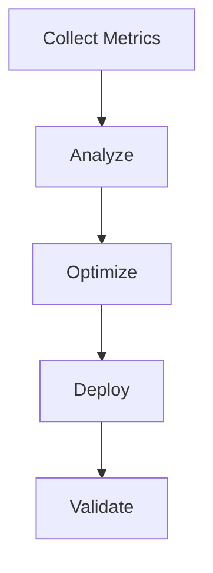

# PHASE2-2.11 PART2: Documentation - Execution and Validation Plan

**Phase**: PHASE2-2.11  
**Agent**: Performance Agent  
**Objective**: Execute documentation creation and validate completeness  
**Estimated Time**: 15 minutes  
**Priority**: HIGH

---

## Overview

This document outlines the execution steps for creating comprehensive documentation for the Performance Agent, including API docs, architecture guides, deployment instructions, and user guides.

---

## Execution Strategy

### Approach
1. **API Docs**: Document all REST endpoints
2. **Architecture**: System design and components
3. **Deployment**: Installation and deployment guides
4. **User Guide**: Usage examples and best practices
5. **Development**: Contributing and testing guides

### Priority Order
1. **API Documentation** (High Priority) - Essential for users
2. **Deployment Guide** (High Priority) - Essential for operators
3. **User Guide** (Medium Priority) - Helpful for adoption
4. **Architecture** (Medium Priority) - Helpful for understanding
5. **Development Guide** (Low Priority) - For contributors

---

## Execution Plan

### Phase 1: Setup Documentation Structure (2 minutes)

#### Task 1.1: Create Documentation Directory

```bash
cd C:\Users\alpes\OneDrive\Documents\Important Projects\optiinfra\services\performance-agent

# Create docs directory structure
mkdir docs
mkdir docs\api
mkdir docs\architecture
mkdir docs\deployment
mkdir docs\user-guide
mkdir docs\development
```

---

### Phase 2: API Documentation (5 minutes)

#### Task 2.1: Create API Reference
**File**: `docs/api/README.md`

Create comprehensive API documentation including:
- All endpoints (health, config, metrics, analysis, optimization, workflows)
- Request/response examples
- Error codes
- Authentication (if any)

#### Task 2.2: Update Main README
**File**: `README.md`

Update with:
- Quick start guide
- API overview
- Links to detailed docs

---

### Phase 3: Architecture Documentation (3 minutes)

#### Task 3.1: Create Architecture Guide
**File**: `docs/architecture/README.md`

Document:
- System overview
- Component diagram
- Data flow
- Integration points
- Scalability considerations

---

### Phase 4: Deployment Documentation (3 minutes)

#### Task 4.1: Create Deployment Guide
**File**: `docs/deployment/README.md`

Include:
- Local development setup
- Docker deployment
- Kubernetes deployment
- Configuration options
- Health checks
- Monitoring setup

---

### Phase 5: User and Development Guides (2 minutes)

#### Task 5.1: Create User Guide
**File**: `docs/user-guide/README.md`

Include:
- Quick start
- Common use cases
- Code examples
- Best practices
- Troubleshooting

#### Task 5.2: Create Development Guide
**File**: `docs/development/README.md`

Include:
- Development setup
- Project structure
- Running tests
- Code style
- Contributing guidelines

---

## Validation Plan

### Step 1: Validate Documentation Structure

```bash
# Check all documentation files exist
ls docs/
ls docs/api/
ls docs/architecture/
ls docs/deployment/
ls docs/user-guide/
ls docs/development/
```

**Expected Files**:
- `docs/README.md`
- `docs/api/README.md`
- `docs/architecture/README.md`
- `docs/deployment/README.md`
- `docs/user-guide/README.md`
- `docs/development/README.md`

---

### Step 2: Validate API Documentation

**Checklist**:
- [ ] All endpoints documented
- [ ] Request examples provided
- [ ] Response examples provided
- [ ] Error codes listed
- [ ] Authentication documented

**Validation**:
```bash
# Check API docs exist and are complete
cat docs/api/README.md | grep "GET /health"
cat docs/api/README.md | grep "POST /metrics/collect"
cat docs/api/README.md | grep "POST /workflows"
```

---

### Step 3: Validate Architecture Documentation

**Checklist**:
- [ ] System overview included
- [ ] Component diagram present
- [ ] Data flow explained
- [ ] Integration points documented
- [ ] Scalability discussed

**Validation**:
```bash
# Check architecture docs
cat docs/architecture/README.md | grep "System Architecture"
cat docs/architecture/README.md | grep "Components"
cat docs/architecture/README.md | grep "Data Flow"
```

---

### Step 4: Validate Deployment Documentation

**Checklist**:
- [ ] Local setup instructions
- [ ] Docker deployment guide
- [ ] Kubernetes manifests
- [ ] Configuration options
- [ ] Health check endpoints
- [ ] Troubleshooting section

**Validation**:
```bash
# Check deployment docs
cat docs/deployment/README.md | grep "Local Development"
cat docs/deployment/README.md | grep "Docker Deployment"
cat docs/deployment/README.md | grep "Kubernetes Deployment"
```

---

### Step 5: Validate User Guide

**Checklist**:
- [ ] Quick start guide
- [ ] Usage examples
- [ ] Common use cases
- [ ] Best practices
- [ ] Troubleshooting tips

**Validation**:
```bash
# Check user guide
cat docs/user-guide/README.md | grep "Quick Start"
cat docs/user-guide/README.md | grep "Use Case"
cat docs/user-guide/README.md | grep "Best Practices"
```

---

### Step 6: Validate Development Guide

**Checklist**:
- [ ] Development setup
- [ ] Project structure
- [ ] Testing instructions
- [ ] Code style guidelines
- [ ] Contributing guide

**Validation**:
```bash
# Check development guide
cat docs/development/README.md | grep "Development Setup"
cat docs/development/README.md | grep "Running Tests"
cat docs/development/README.md | grep "Contributing"
```

---

## Validation Checklist

### Documentation Completeness

#### API Documentation
- [ ] Health endpoints documented
- [ ] Config endpoints documented
- [ ] Metrics endpoints documented
- [ ] Analysis endpoints documented
- [ ] Optimization endpoints documented
- [ ] Workflow endpoints documented
- [ ] Error codes listed
- [ ] Examples provided

#### Architecture Documentation
- [ ] System overview
- [ ] Component descriptions
- [ ] Data flow diagram
- [ ] Integration points
- [ ] Configuration details
- [ ] Scalability notes

#### Deployment Documentation
- [ ] Prerequisites listed
- [ ] Local setup guide
- [ ] Docker instructions
- [ ] Kubernetes manifests
- [ ] Environment variables
- [ ] Health checks
- [ ] Monitoring setup
- [ ] Troubleshooting

#### User Guide
- [ ] Quick start guide
- [ ] At least 3 use cases
- [ ] Code examples
- [ ] Best practices
- [ ] Troubleshooting tips

#### Development Guide
- [ ] Setup instructions
- [ ] Project structure
- [ ] Test commands
- [ ] Code style guide
- [ ] Contributing guidelines

---

## Success Metrics

### Documentation Coverage

**Required Sections**:
```
✅ API Reference
✅ Architecture Overview
✅ Deployment Guide
✅ User Guide
✅ Development Guide
```

**Quality Metrics**:
- **Clarity**: Easy to understand
- **Completeness**: All topics covered
- **Examples**: Code samples included
- **Accuracy**: Tested and verified
- **Maintainability**: Easy to update

---

## Post-Validation Steps

### After Successful Validation

1. **Generate API Docs**:
```bash
# If using FastAPI, auto-generate OpenAPI docs
# Access at http://localhost:8002/docs
```

2. **Create Documentation Index**:
**File**: `docs/README.md`

```markdown
# Performance Agent Documentation

## Getting Started
- [Quick Start](user-guide/README.md#quick-start)
- [Installation](deployment/README.md)

## API Reference
- [REST API](api/README.md)
- [OpenAPI Spec](http://localhost:8002/docs)

## Guides
- [User Guide](user-guide/README.md)
- [Deployment Guide](deployment/README.md)
- [Architecture](architecture/README.md)
- [Development](development/README.md)

## Support
- Issues: GitHub Issues
- Email: support@example.com
```

3. **Update Main README**:
Add documentation links to main `README.md`:

```markdown
## Documentation

- [API Reference](docs/api/README.md)
- [User Guide](docs/user-guide/README.md)
- [Deployment Guide](docs/deployment/README.md)
- [Architecture](docs/architecture/README.md)
- [Development](docs/development/README.md)
```

4. **Commit Documentation**:
```bash
git add docs/
git add README.md
git commit -m "docs: add comprehensive documentation (PHASE2-2.11)"
git push origin main
```

---

## Optional Enhancements

### 1. Generate PDF Documentation

```bash
# Install pandoc
# Convert markdown to PDF
pandoc docs/api/README.md -o docs/api/API-Reference.pdf
```

### 2. Setup Documentation Site

Use tools like:
- **MkDocs**: `mkdocs serve`
- **Docusaurus**: React-based docs
- **GitBook**: Online documentation

### 3. Add Diagrams

Use tools like:
- **Mermaid**: Markdown diagrams
- **PlantUML**: UML diagrams
- **Draw.io**: Visual diagrams

Example Mermaid diagram:
```markdown

```

---

## Troubleshooting

### Issue 1: Documentation Not Rendering

**Solution**:
- Check markdown syntax
- Verify file encoding (UTF-8)
- Test with markdown viewer

### Issue 2: Missing Examples

**Solution**:
- Add code examples for each endpoint
- Test examples before documenting
- Include expected outputs

### Issue 3: Outdated Information

**Solution**:
- Review docs regularly
- Update with code changes
- Add version numbers

---

## Timeline

| Task | Duration | Status |
|------|----------|--------|
| Setup Structure | 2 min | Pending |
| API Documentation | 5 min | Pending |
| Architecture Docs | 3 min | Pending |
| Deployment Guide | 3 min | Pending |
| User & Dev Guides | 2 min | Pending |
| **Total** | **15 min** | **Pending** |

---

## Deliverables

### Documentation Files
- ✅ `docs/README.md` - Documentation index
- ✅ `docs/api/README.md` - API reference
- ✅ `docs/architecture/README.md` - Architecture guide
- ✅ `docs/deployment/README.md` - Deployment guide
- ✅ `docs/user-guide/README.md` - User guide
- ✅ `docs/development/README.md` - Development guide

### Updated Files
- ✅ `README.md` - Updated with doc links

### Optional Deliverables
- ⚪ PDF documentation
- ⚪ Documentation website
- ⚪ Video tutorials
- ⚪ API playground

---

## Example Validation

### Complete Validation Run

```bash
# 1. Check structure
ls -R docs/

# 2. Validate API docs
grep -c "GET\|POST" docs/api/README.md

# 3. Validate examples
grep -c "```" docs/user-guide/README.md

# 4. Check completeness
wc -l docs/**/*.md

# 5. Verify links
# Use markdown link checker
```

---

## Notes

### Important Considerations
1. **Keep Updated**: Update docs with code changes
2. **Test Examples**: Verify all code examples work
3. **Version Control**: Track doc versions
4. **Accessibility**: Use clear language
5. **Searchability**: Use good headings and keywords

### Documentation Best Practices
- Use consistent formatting
- Include table of contents
- Add navigation links
- Provide context
- Use visual aids
- Keep it concise

### Maintenance
- Review quarterly
- Update with releases
- Gather user feedback
- Fix broken links
- Update screenshots

---

**Status**: Ready for execution  
**Estimated Completion**: 15 minutes  
**Target**: Complete, production-ready documentation
