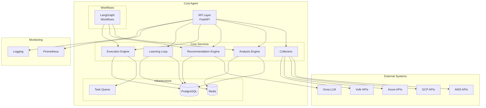
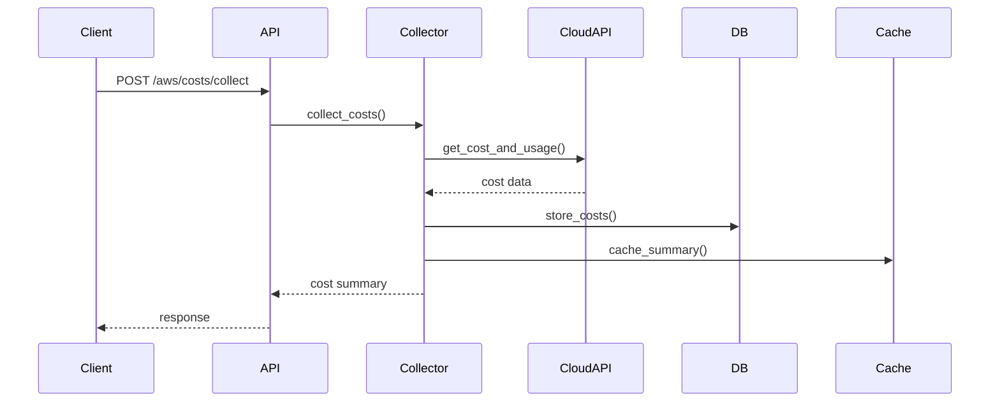
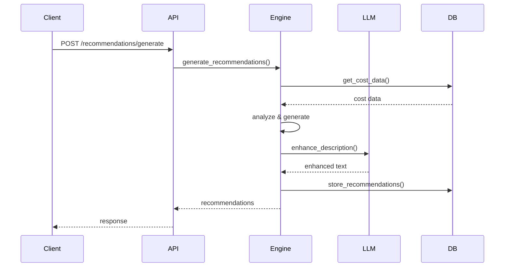
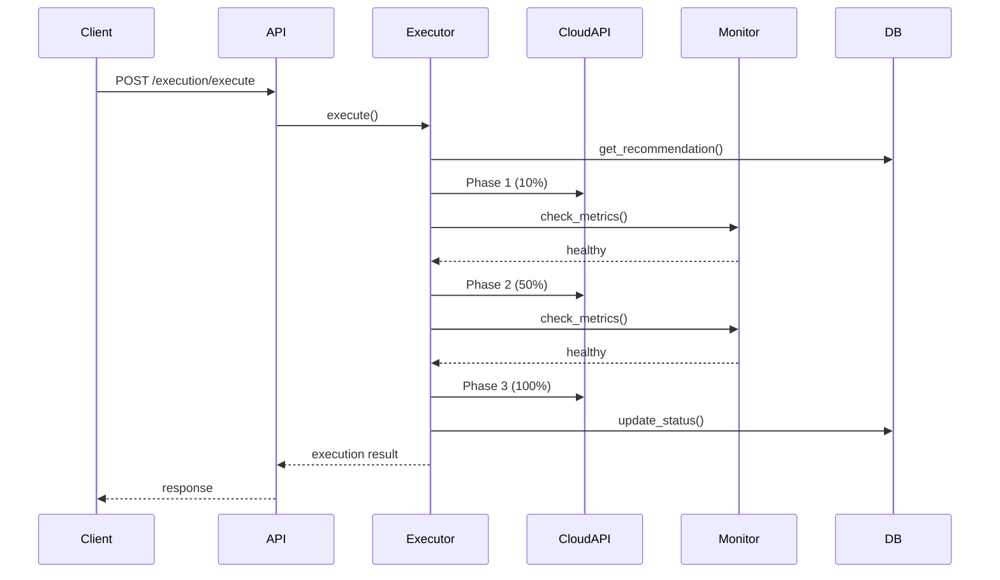

# Cost Agent Architecture

**Version**: 1.0.0  
**Last Updated**: 2025-01-23

---

## Table of Contents

- [Overview](#overview)
- [High-Level Architecture](#high-level-architecture)
- [Core Components](#core-components)
- [Data Flow](#data-flow)
- [Technology Stack](#technology-stack)
- [Design Patterns](#design-patterns)
- [Scalability](#scalability)
- [Security Architecture](#security-architecture)
- [Performance Considerations](#performance-considerations)

---

## Overview

The Cost Agent is a microservice responsible for cloud cost optimization across multiple cloud providers (AWS, GCP, Azure, Vultr). It uses AI-powered analysis, intelligent recommendations, and automated execution with continuous learning.

### Key Capabilities

- **Multi-Cloud Support**: AWS, GCP, Azure, Vultr
- **Real-Time Analysis**: Anomaly detection, trend analysis, forecasting
- **AI-Powered Recommendations**: LLM-enhanced cost optimization suggestions
- **Automated Execution**: Gradual rollout with automatic rollback
- **Continuous Learning**: Feedback-driven improvement

---

## High-Level Architecture



---

## Core Components

### 1. API Layer

**Technology**: FastAPI  
**Purpose**: RESTful API interface for all operations

**Key Features**:
- OpenAPI/Swagger documentation
- Request validation (Pydantic)
- Authentication & authorization
- Rate limiting
- CORS support
- Prometheus metrics

**Endpoints**:
- Health & status
- Authentication
- Cost collection
- Analysis
- Recommendations
- Execution
- Learning
- Bulk operations
- Webhooks
- Notifications

---

### 2. Collectors

**Purpose**: Collect cost and resource data from cloud providers

#### AWS Collector
- **Services**: Cost Explorer, EC2, RDS, S3, Lambda
- **Features**: 
  - Cost and usage data collection
  - Resource metadata collection
  - Tag-based filtering
  - Multi-account support

#### GCP Collector
- **Services**: BigQuery Billing, Compute Engine, Cloud SQL, Cloud Storage
- **Features**:
  - BigQuery billing export
  - Resource inventory
  - Label-based filtering
  - Project-level collection

#### Azure Collector
- **Services**: Cost Management API, Virtual Machines, SQL Database, Storage
- **Features**:
  - Subscription-level costs
  - Resource group filtering
  - Tag-based organization
  - Usage details

#### Vultr Collector
- **Services**: Billing API, Instances, Block Storage
- **Features**:
  - Account-level billing
  - Instance metadata
  - Simple cost tracking

**Architecture**:
```python
class BaseCollector:
    """Base class for all collectors"""
    async def collect_costs()
    async def collect_resources()
    async def validate_credentials()

class AWSCollector(BaseCollector):
    """AWS-specific implementation"""
    
class GCPCollector(BaseCollector):
    """GCP-specific implementation"""
```

---

### 3. Analysis Engine

**Purpose**: Analyze cost data and detect patterns

#### Components

##### Anomaly Detector
- **Algorithm**: Statistical analysis + ML models
- **Features**:
  - Time-series anomaly detection
  - Multi-dimensional analysis
  - Confidence scoring
  - Severity classification

##### Trend Analyzer
- **Algorithm**: Linear regression + moving averages
- **Features**:
  - Historical trend analysis
  - Rate of change calculation
  - Pattern recognition
  - Seasonality detection

##### Cost Forecaster
- **Algorithm**: ARIMA + Prophet
- **Features**:
  - Short-term forecasting (1-3 months)
  - Confidence intervals
  - Scenario analysis
  - Budget projections

**Data Flow**:
```
Cost Data → Preprocessing → Analysis → Results → Storage
                ↓
          Feature Engineering
                ↓
          Model Inference
                ↓
          Post-processing
```

---

### 4. Recommendation Engine

**Purpose**: Generate intelligent cost optimization recommendations

#### Components

##### Generator
- **Input**: Cost data, resource metadata, analysis results
- **Output**: Ranked recommendations with implementation details
- **Types**:
  - Spot instance migration
  - Reserved instance purchases
  - Right-sizing
  - Idle resource termination
  - Storage optimization

##### Scorer
- **Factors**:
  - Estimated savings (40%)
  - Implementation effort (20%)
  - Risk level (20%)
  - Confidence score (20%)
- **Output**: Priority score (0-100)

##### Validator
- **Checks**:
  - Feasibility validation
  - Dependency checking
  - Conflict detection
  - Prerequisites verification

##### LLM Integration
- **Provider**: Groq (llama-3.1-70b)
- **Purpose**: Enhanced recommendation descriptions and insights
- **Features**:
  - Natural language explanations
  - Context-aware suggestions
  - Implementation guidance

**Architecture**:
```python
class RecommendationEngine:
    def __init__(self):
        self.generator = Generator()
        self.scorer = Scorer()
        self.validator = Validator()
        self.llm_client = GroqClient()
    
    async def generate_recommendations(self, data):
        # Generate base recommendations
        recommendations = await self.generator.generate(data)
        
        # Enhance with LLM
        for rec in recommendations:
            rec.description = await self.llm_client.enhance(rec)
        
        # Score and rank
        scored = await self.scorer.score(recommendations)
        
        # Validate
        validated = await self.validator.validate(scored)
        
        return validated
```

---

### 5. Execution Engine

**Purpose**: Execute approved recommendations with safety mechanisms

#### Components

##### Executor
- **Modes**: Immediate, gradual, scheduled
- **Features**:
  - Phased rollout (10% → 50% → 100%)
  - Progress tracking
  - Metrics collection
  - Error handling

##### Validator
- **Pre-execution**: Verify prerequisites and permissions
- **During execution**: Monitor metrics and health
- **Post-execution**: Validate success and measure impact

##### Rollback Manager
- **Triggers**:
  - Error rate threshold exceeded
  - Performance degradation detected
  - Manual intervention
- **Features**:
  - Automatic rollback
  - State restoration
  - Audit trail

**Execution Flow**:
```
Approval → Pre-validation → Phase 1 (10%) → Monitor → 
Phase 2 (50%) → Monitor → Phase 3 (100%) → Validation → Complete
                    ↓
              Rollback (if needed)
```

---

### 6. Learning Loop

**Purpose**: Continuous improvement through feedback

#### Components

##### Outcome Tracker
- **Tracks**:
  - Execution results
  - Actual vs. estimated savings
  - Performance impact
  - User feedback

##### Feedback Analyzer
- **Analyzes**:
  - Success patterns
  - Failure causes
  - Accuracy metrics
  - User satisfaction

##### Improvement Engine
- **Actions**:
  - Model retraining
  - Parameter tuning
  - Confidence adjustment
  - Strategy refinement

**Learning Cycle**:
```
Execute → Measure → Analyze → Learn → Improve → Execute
```

---

### 7. Workflows (LangGraph)

**Purpose**: Orchestrate complex multi-step operations

#### Cost Optimization Workflow
```
START → Collect → Analyze → Recommend → Summarize → END
```

#### Spot Migration Workflow
```
START → Analyze → Coordinate → Execute → Monitor → END
                      ↓
                  Rollback (if needed)
```

#### Reserved Instance Workflow
```
START → Analyze Usage → Calculate ROI → Recommend → END
```

**State Management**:
- TypedDict for type safety
- Checkpointing for persistence
- State validation
- Error recovery

---

## Data Flow

### Cost Collection Flow



### Recommendation Flow



### Execution Flow



---

## Technology Stack

### Core Technologies

| Component | Technology | Version | Purpose |
|-----------|-----------|---------|---------|
| Runtime | Python | 3.11+ | Application runtime |
| Web Framework | FastAPI | 0.104+ | REST API |
| Async | asyncio | Built-in | Async operations |
| Validation | Pydantic | 2.0+ | Data validation |
| Workflows | LangGraph | 0.0.20+ | AI workflows |
| LLM | Groq | Latest | AI insights |

### Data Storage

| Component | Technology | Purpose |
|-----------|-----------|---------|
| Primary DB | PostgreSQL | Persistent storage |
| Cache | Redis | Fast data access |
| Time-series | PostgreSQL + TimescaleDB | Cost metrics |

### Cloud SDKs

| Provider | SDK | Purpose |
|----------|-----|---------|
| AWS | boto3 | AWS API access |
| GCP | google-cloud | GCP API access |
| Azure | azure-sdk | Azure API access |
| Vultr | requests | Vultr API access |

### Monitoring & Observability

| Component | Technology | Purpose |
|-----------|-----------|---------|
| Metrics | Prometheus | Metrics collection |
| Logging | Python logging | Application logs |
| Tracing | OpenTelemetry (future) | Distributed tracing |

---

## Design Patterns

### 1. Repository Pattern
- Abstracts data access
- Enables testing with mocks
- Supports multiple storage backends

```python
class CostRepository:
    async def save(self, cost_data)
    async def find_by_date_range(self, start, end)
    async def find_by_service(self, service)
```

### 2. Factory Pattern
- Creates collectors based on provider
- Enables easy addition of new providers

```python
class CollectorFactory:
    @staticmethod
    def create(provider: str) -> BaseCollector:
        if provider == "aws":
            return AWSCollector()
        elif provider == "gcp":
            return GCPCollector()
        # ...
```

### 3. Strategy Pattern
- Different execution strategies
- Pluggable recommendation algorithms

```python
class ExecutionStrategy(ABC):
    @abstractmethod
    async def execute(self, recommendation)

class GradualRolloutStrategy(ExecutionStrategy):
    async def execute(self, recommendation):
        # Gradual rollout logic
```

### 4. Observer Pattern
- Event-driven notifications
- Webhook callbacks
- Metrics collection

```python
class EventEmitter:
    def subscribe(self, event_type, callback)
    def emit(self, event_type, data)
```

---

## Scalability

### Horizontal Scaling

- **Stateless API**: Multiple instances behind load balancer
- **Shared State**: PostgreSQL + Redis for coordination
- **Task Distribution**: Queue-based task distribution

### Vertical Scaling

- **Database**: Read replicas for queries
- **Cache**: Redis cluster for high availability
- **Compute**: Resource limits per container

### Performance Optimization

- **Caching**: Redis for frequently accessed data
- **Connection Pooling**: Database connection pools
- **Async I/O**: Non-blocking operations
- **Batch Processing**: Bulk operations for efficiency

### Load Handling

- **Rate Limiting**: Per-customer rate limits
- **Queue Management**: Task queues for long operations
- **Circuit Breakers**: Fail fast on external API errors
- **Graceful Degradation**: Fallback mechanisms

---

## Security Architecture

### Authentication & Authorization

- **API Keys**: Long-lived credentials
- **JWT Tokens**: Short-lived session tokens
- **Role-Based Access**: Customer-level isolation

### Data Security

- **Encryption at Rest**: Database encryption
- **Encryption in Transit**: TLS/HTTPS
- **Secrets Management**: Environment variables + vault
- **PII Protection**: No sensitive data logging

### Network Security

- **CORS**: Configured allowed origins
- **Rate Limiting**: DDoS protection
- **Input Validation**: Pydantic schemas
- **SQL Injection**: Parameterized queries

### Audit & Compliance

- **Audit Logs**: All operations logged
- **Access Logs**: API access tracking
- **Change Tracking**: Execution history
- **Compliance**: SOC 2, GDPR ready

---

## Performance Considerations

### Response Times

- **Health Check**: < 100ms
- **Cost Collection**: < 5s
- **Analysis**: < 10s
- **Recommendations**: < 15s
- **Execution**: Async (minutes to hours)

### Throughput

- **API Requests**: 1000+ req/s
- **Cost Collection**: 100+ providers/min
- **Recommendations**: 50+ generations/min
- **Executions**: 10+ concurrent executions

### Resource Usage

- **Memory**: ~200 MB per instance
- **CPU**: < 50% under normal load
- **Database**: < 100 connections
- **Cache**: < 1 GB Redis memory

### Optimization Techniques

- **Query Optimization**: Indexed queries
- **Caching Strategy**: Multi-level caching
- **Async Processing**: Non-blocking I/O
- **Batch Operations**: Bulk processing
- **Connection Reuse**: Persistent connections

---

## Future Enhancements

### Planned Features

- **Multi-Region Support**: Global deployment
- **Advanced ML Models**: Deep learning for predictions
- **Real-Time Streaming**: Live cost monitoring
- **GraphQL API**: Alternative API interface
- **Mobile SDK**: Native mobile support

### Scalability Improvements

- **Kubernetes**: Container orchestration
- **Service Mesh**: Istio for microservices
- **Event Streaming**: Kafka for events
- **Distributed Tracing**: Full observability

---

**Document Version**: 1.0.0  
**Last Updated**: 2025-01-23  
**Maintained By**: OptiInfra Engineering Team
